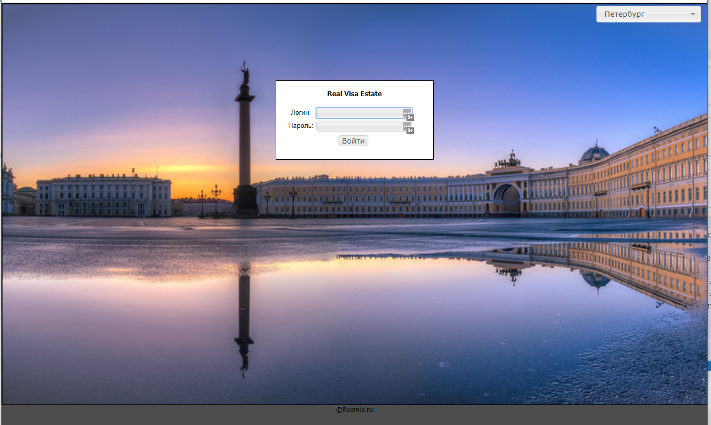
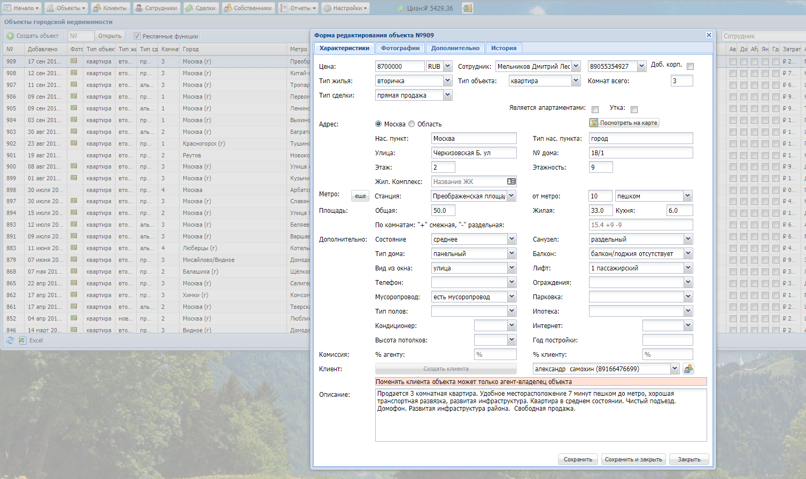
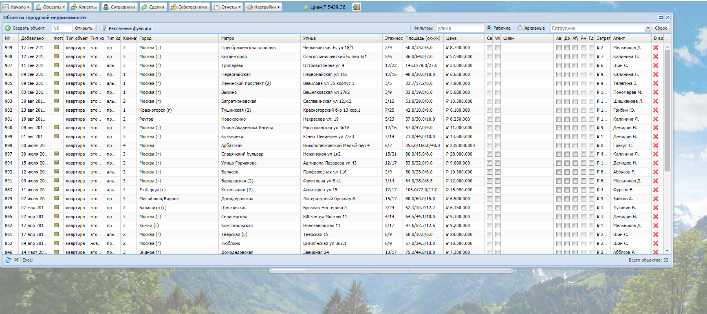
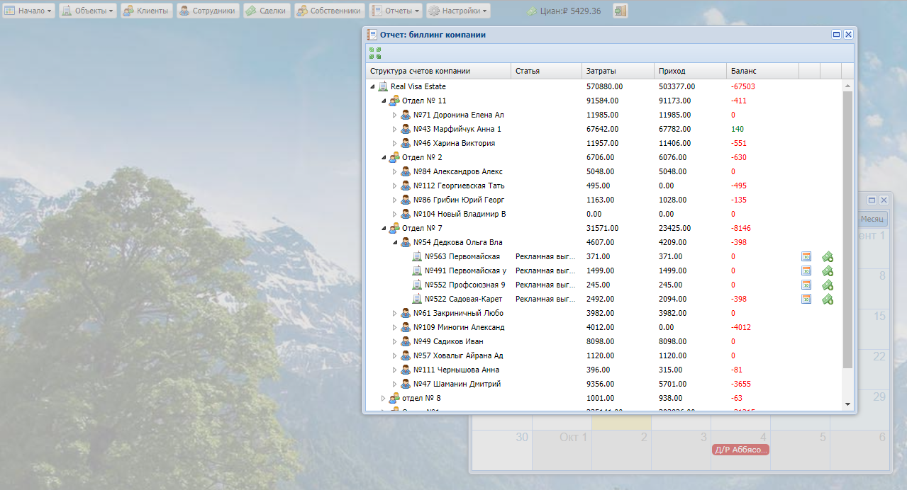
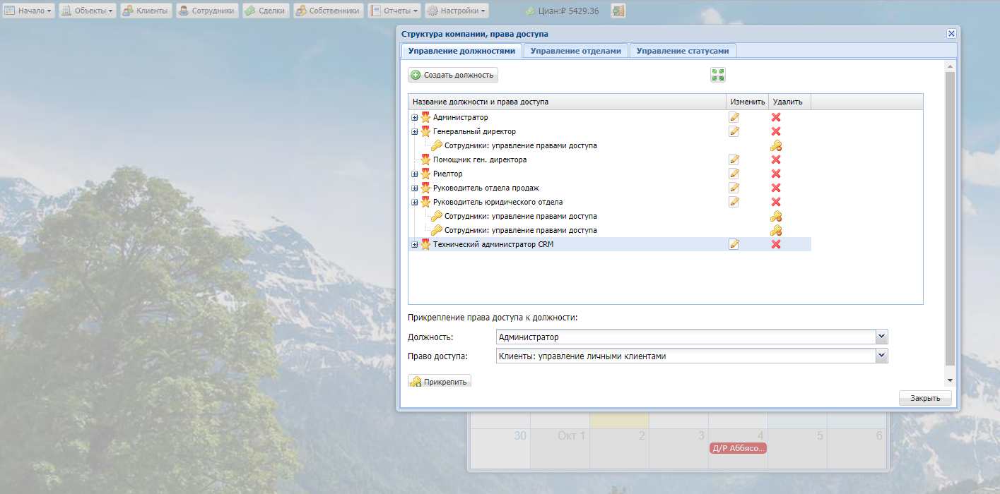
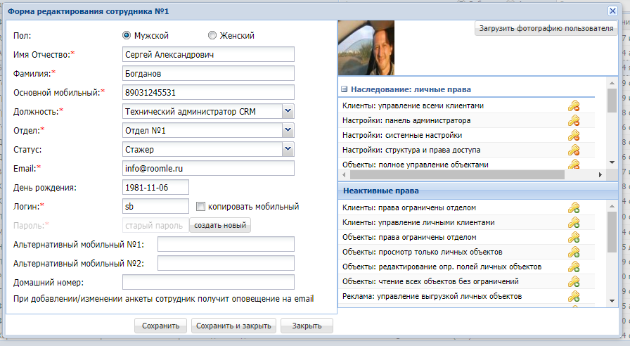
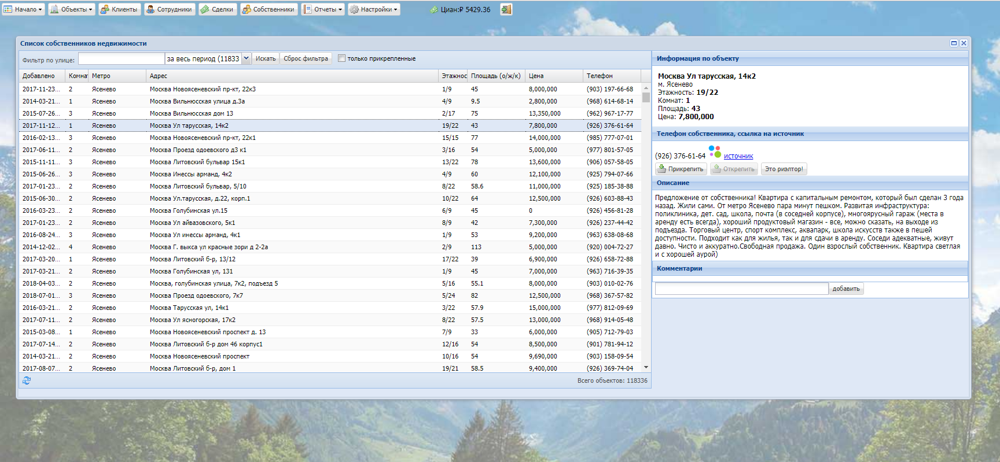
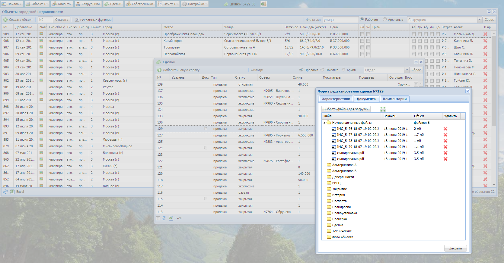
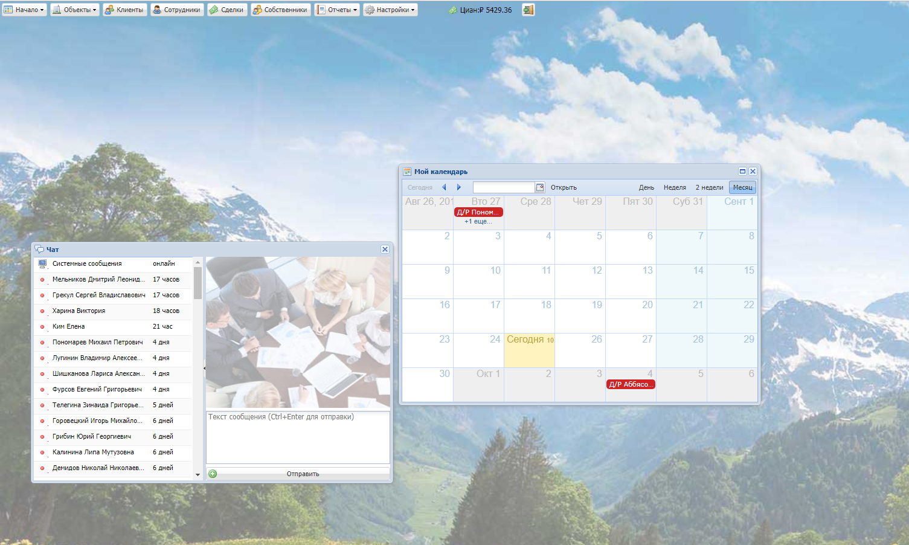

## RoomleCRM
Посмотреть/have a glance at <a href="/Screens">**./Screens/**</a>
## CRM for Realty agencies. Startup at 2014-2017
## Main functions:
- Flats, new buildings, suburban, commercial database.
- Advertising management (xml preparation for ad portals).
- Billing for advertising costs.
- Management of organizational structure and access rights.
- Parser and interface for flat owners.
- Customer base.
- Storage of deals with attachment of documents.
- User-friendly window interface.
- Calendar with reminders.
- Company chat.

## CRM для агенств недвижимости.
## Основные функции:
- Удобный оконный интерфейс

- База квартир (вторичка,новостройки,загородка,коммерческая) для агенства недвижимости.

- Управление выгрузкой в рекламные порталы (подготовка xml).

- Биллинг по затратам на рекламу.

- Управление оргструктурой и правами доступа.

- Самостоятельная база собственников.

- База клиентов.
- Хранение сделок с прикреплением документов.

- Календарь с напоминаниями
- Чат компании.

